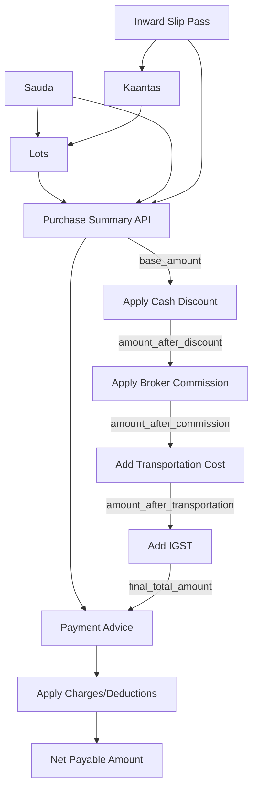

# Remove Purchase Module & Restructure Payment Advice

## Overview

Remove the entire Purchase entity and replace it with summary APIs that calculate totals on-the-fly from lots. Restructure Payment Advice to work directly with saudas and ISPs, supporting both single-sauda and multi-sauda (via ISP) payment advice creation.

## Part 1: Remove Purchase Module

### 1.1 Delete Purchase Files

Remove all purchase-related files:

- `src/models/purchase.model.ts`
- `src/dao/purchase.dao.ts`
- `src/dao/purchase-sauda.dao.ts`
- `src/dao/purchase-inward-slip-pass.dao.ts`
- `src/dao/purchase-lot.dao.ts`
- `src/controllers/purchase.controller.ts`
- `src/routes/purchase.routes.ts`
- `src/utils/purchase-calculations.ts`

### 1.2 Database Migration

Create migration to:

- Drop `purchases` table
- Drop junction tables: `purchase_saudas`, `purchase_inward_slip_passes`, `purchase_lots`
- Remove `purchase_id` foreign key from `payment_advices` (will be replaced with sauda_id/isp_id)

### 1.3 Update Routes

Remove purchase routes from `src/routes/index.ts`

## Part 2: Create Summary/Totals APIs

### 2.1 New Summary Model

Create `src/models/purchase-summary.model.ts` with response interface showing:**Separate Fields (Vendor POV - Purchase Flow):**

- `total_lots`: Number of lots
- `total_bags`: Sum of all bags
- `total_weight`: Sum of received_weight from all lots
- `base_amount`: Sum of lot amounts (received_weight × rate)
- `cash_discount_amount`: Calculated discount (from sauda)
- `amount_after_discount`: base_amount - cash_discount
- `broker_commission_amount`: Calculated commission (from sauda)
- `amount_after_commission`: amount_after_discount + broker_commission
- `transportation_cost`: Sum from linked ISPs
- `amount_after_transportation`: amount_after_commission + transportation_cost
- `igst_amount`: Calculated IGST
- `final_total_amount`: Final payable amount

**Aggregated Summary:**

- `net_payable`: Final amount vendor should pay

**Metadata:**

- Sauda details (rice_type, rate, etc.)
- ISP details (slip_numbers, vehicle_numbers)
- Lot details (lot_numbers, weights)

### 2.2 Summary DAO

Create `src/dao/purchase-summary.dao.ts`:

- `getSaudaSummary(saudaId)` - Get summary for one sauda
- Aggregate all lots for this sauda
- Get sauda-level cash_discount, broker_commission
- Get transportation_cost from linked ISPs
- Calculate step-by-step breakdown
- Return detailed response with separate fields
- `getIspSummary(ispId)` - Get summary for one ISP
- Get all saudas linked to this ISP
- Aggregate lots for each sauda
- Calculate totals per sauda
- Return combined summary with per-sauda breakdown

### 2.3 Summary Controller

Create `src/controllers/purchase-summary.controller.ts`:

- `GET /api/v1/purchase-summary/sauda/:saudaId` - Get summary by sauda
- `GET /api/v1/purchase-summary/isp/:ispId` - Get summary by ISP (all saudas)

### 2.4 Summary Routes

Create `src/routes/purchase-summary.routes.ts` and register in main router

## Part 3: Update Payment Advice

### 3.1 Update Payment Advice Model

Modify `src/models/payment-advice.model.ts`:

- Remove `purchase_id` field
- Add `sauda_id` field (UUID, optional)
- Add `inward_slip_pass_id` field (UUID, optional)
- Keep all existing fields (amount, charges, etc.)
- At least one of sauda_id or inward_slip_pass_id must be provided

### 3.2 Database Migration for Payment Advice

Create migration to:

- Remove `purchase_id` column from `payment_advices`
- Add `sauda_id` column (references saudas, nullable)
- Add `inward_slip_pass_id` column (references inward_slip_passes, nullable)
- Add check constraint: `(sauda_id IS NOT NULL OR inward_slip_pass_id IS NOT NULL)`

### 3.3 Update Payment Advice DAO

Modify `src/dao/payment-advice.dao.ts`:

- Update `findAll()` to support filtering by sauda_id or isp_id
- Update `create()` to:
- Accept sauda_id OR inward_slip_pass_id
- If sauda_id provided: calculate amount from that sauda's summary
- If isp_id provided: calculate amount from all saudas in that ISP
- Apply charges (deductions) - same logic as before
- Calculate net_payable = amount - sum(charges)

### 3.4 Update Payment Advice Controller

Modify `src/controllers/payment-advice.controller.ts`:

- Update create endpoint to handle new fields
- Add validation: at least one of sauda_id or isp_id required
- Auto-calculate amount from summary API
- Keep existing charge logic (percentage/fixed deductions)

### 3.5 Update Validation Schemas

Modify `src/utils/validators.ts`:

- Remove purchase_id validation
- Add sauda_id and inward_slip_pass_id (both optional)
- Add custom validation: at least one must be provided

## Calculation Logic

### Summary Calculation (Vendor POV)

```javascript
For a Sauda:
1. Get all lots for sauda
2. base_amount = SUM(lot.amount) = SUM(lot.received_weight × lot.rate)
3. total_weight = SUM(lot.received_weight)
4. total_bags = SUM(lot.no_of_bags)

5. cash_discount_amount:
            - If sauda.cash_discount_type = 'percentage': base_amount × (sauda.cash_discount / 100)
            - If sauda.cash_discount_type = 'rupees': sauda.cash_discount
   
6. amount_after_discount = base_amount - cash_discount_amount

7. broker_commission_amount:
            - If sauda.broker_commission_type = 'percentage': amount_after_discount × (sauda.broker_commission / 100)
            - If sauda.broker_commission_type = 'rupees': sauda.broker_commission
            - If sauda.broker_commission_type = 'weight': sauda.broker_commission × total_weight
   
8. amount_after_commission = amount_after_discount + broker_commission_amount

9. transportation_cost = SUM(isp.transportation_cost) for all ISPs linked to this sauda

10. amount_after_transportation = amount_after_commission + transportation_cost

11. igst_amount = amount_after_transportation × (igst_percentage / 100)
    (Note: IGST percentage comes from where? Need clarification - maybe sauda-level or user-provided)

12. final_total_amount = amount_after_transportation + igst_amount
```


### Payment Advice Amount Calculation

```javascript
When creating payment advice:

Mode 1: Single Sauda
- Get summary for sauda_id
- amount = summary.final_total_amount

Mode 2: ISP (Multiple Saudas)
- Get summary for isp_id (aggregates all saudas)
- amount = sum of all sauda final_total_amounts in that ISP

Then apply charges:
- For each charge:
        - If charge_type = 'fixed': deduction = charge_value
        - If charge_type = 'percentage': deduction = amount × (charge_value / 100)
  
net_payable = amount - SUM(all deductions)
```


## Data Flow Diagram




## Implementation Steps

### Phase 1: Create Summary APIs (Don't break existing)

1. Create summary models
2. Create summary DAO with calculation logic
3. Create summary controller
4. Create summary routes
5. Test summary endpoints

### Phase 2: Update Payment Advice

1. Create migration for payment_advices (add sauda_id, isp_id)
2. Update payment advice models
3. Update payment advice DAO (integrate with summary)
4. Update payment advice controller
5. Update validation schemas
6. Test payment advice with new fields

### Phase 3: Remove Purchase Module

1. Create migration to drop purchase tables
2. Delete purchase files
3. Remove purchase routes
4. Remove purchase calculation utilities
5. Test that nothing breaks

## Files to Create

1. `src/models/purchase-summary.model.ts`
2. `src/dao/purchase-summary.dao.ts`
3. `src/controllers/purchase-summary.controller.ts`
4. `src/routes/purchase-summary.routes.ts`
5. `src/database/migrations/056_update_payment_advice_remove_purchase.sql`
6. `src/database/migrations/057_drop_purchase_tables.sql`

## Files to Modify

1. `src/models/payment-advice.model.ts`
2. `src/dao/payment-advice.dao.ts`
3. `src/controllers/payment-advice.controller.ts`
4. `src/utils/validators.ts`
5. `src/routes/index.ts`

## Files to Delete

1. `src/models/purchase.model.ts`
2. `src/dao/purchase.dao.ts`
3. `src/dao/purchase-sauda.dao.ts`
4. `src/dao/purchase-inward-slip-pass.dao.ts`
5. `src/dao/purchase-lot.dao.ts`
6. `src/controllers/purchase.controller.ts`
7. `src/routes/purchase.routes.ts`
8. `src/utils/purchase-calculations.ts`

## Questions Needing Clarification

1. **IGST Percentage Source**: Where should IGST percentage come from?

- Option A: Add igst_percentage field to sauda
- Option B: Pass as query parameter in summary API
- Option C: Global configuration

2. **Historical Data**: What about existing purchases in database?

- Keep for reference (read-only)?
- Migrate to new structure?
- Archive and delete?