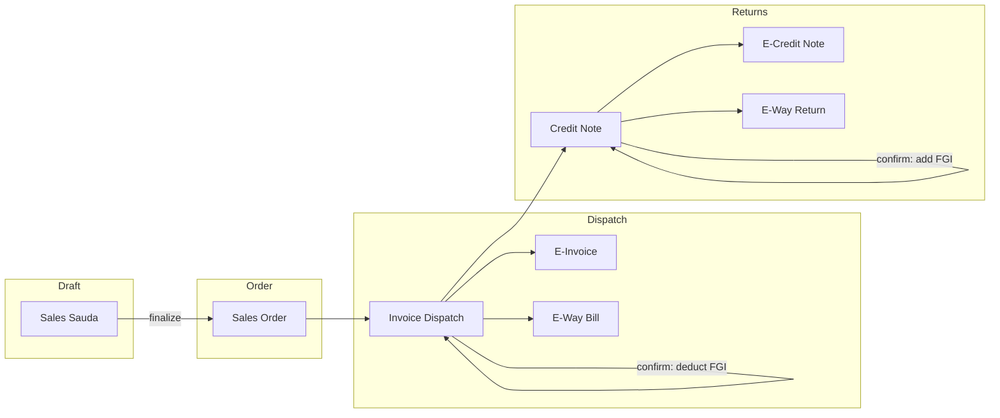

# Sales Module Implementation Plan

## Current State (Reference)

- **Purchase flow**: [src/models/sauda.model.ts](src/models/sauda.model.ts) (purchase sauda) → Inward Slip Pass (document) → Inward Slip Lots (per sauda) → DB trigger creates [lot_inventory](src/database/migrations/069_create_production_inventory_system.sql) rows.
- **Sellable inventory**: [finished_goods_inventory](src/models/finished-goods-inventory.model.ts) (product_id, batch_id, packaging_id, no_of_packets, total_weight). Read via [src/services/inventory.service.ts](src/services/inventory.service.ts); no current reduction path except audit comment in [finished_goods_inventory_audit](src/database/migrations/071_create_inventory_audit_tables.sql).
- **Party**: [Vendor](src/models/vendor.model.ts) with `type: 'purchaser' | 'seller' | 'both'` — use as customer for sales (no new Party entity).
- **Existing patterns**: DAO + Service + Controller + Routes + validators; migrations in [src/database/migrations/](src/database/migrations/); audit in [src/middleware/audit.middleware.ts](src/middleware/audit.middleware.ts).

---

## Architecture and Flow

- **Inventory**: Deduct from `finished_goods_inventory` only on **Invoice Dispatch confirm**. Restore only on **Credit Note confirm**. All movements logged to a new **inventory_ledger** (and optionally to existing `finished_goods_inventory_audit`).

---

## Database Schema (New Tables)

Add migrations under `src/database/migrations/` in this order:

1. **sales_saudas** — id, customer_id (→ vendors), status (draft | order | cancelled), order_number, sauda_date, notes, created_at, updated_at, created_by, updated_by.
2. **sales_sauda_lines** — id, sales_sauda_id, product_id, packaging_id (nullable), quantity, quantity_unit (default 'kg'), rate, amount, sort_order, created_at, updated_at.
3. **invoice_dispatches** — id, sales_sauda_id, internal_invoice_number (unique), dispatch_date, party_name, party_address, party_gst_number, party_pan_number, transporter_id, vehicle_id, distance_km, route_description, status (draft | confirmed), created_at, updated_at, created_by, updated_by.
4. **invoice_dispatch_lines** — id, invoice_dispatch_id, sales_sauda_line_id (nullable), product_id, packaging_id, quantity, quantity_unit, rate, amount, created_at, updated_at.
5. **invoice_dispatch_allocations** — id, invoice_dispatch_id, invoice_dispatch_line_id, finished_goods_inventory_id, quantity_deducted, created_at.
6. **e_invoices** — id, invoice_dispatch_id (unique), irn (unique), acknowledgement_number, ack_date, qr_code_content, government_response_payload (JSONB), status, created_at, updated_at.
7. **e_way_bills** — id, invoice_dispatch_id (nullable), credit_note_id (nullable), eway_bill_number, vehicle_number, distance_km, route, transporter_id, payload (JSONB), created_at, updated_at. Check: at least one of invoice_dispatch_id or credit_note_id set.
8. **credit_notes** — id, invoice_dispatch_id, sales_sauda_id, credit_note_number (unique), credit_note_date, status (draft | confirmed), reason, created_at, updated_at, created_by, updated_by.
9. **credit_note_lines** — id, credit_note_id, invoice_dispatch_line_id, product_id, quantity_returned, created_at, updated_at.
10. **inventory_ledger** — id, product_id, quantity_change (signed), source_type (purchase_inward | sales_dispatch | sale_return | adjustment), source_id (UUID), stock_before, stock_after, reference_type, reference_id, batch_id (nullable), packaging_id (nullable), created_at, created_by.

Indexes: FK columns, status, dates, internal_invoice_number, irn, credit_note_number; composite for ledger (product_id, created_at).

---

## API Design (REST)

- **Sales Sauda**: `POST/GET/PUT/DELETE /api/v1/sales-saudas`, `GET /api/v1/sales-saudas/:id`, `POST /api/v1/sales-saudas/:id/finalize`. Optional: `GET /api/v1/products/:id/availability` (or under sales) for current stock / stock-after-order.
- **Invoice Dispatch**: `POST/GET /api/v1/invoice-dispatches`, `GET /api/v1/invoice-dispatches/:id`, `POST /api/v1/invoice-dispatches/:id/confirm` (inventory check + deduct + allocations + ledger).
- **E-Invoice**: `POST /api/v1/invoice-dispatches/:id/e-invoice` (MasterIndia; store IRN, ack, QR, payload; idempotent by dispatch).
- **E-Way Bill**: `POST /api/v1/invoice-dispatches/:id/e-way-bill` (MasterIndia; store e_way_bills row).
- **Credit Note**: `POST/GET /api/v1/credit-notes`, `GET /api/v1/credit-notes/:id`, `POST /api/v1/credit-notes/:id/confirm` (add back FGI, ledger, then E-CN + E-Way return).
- **Inventory Ledger**: `GET /api/v1/inventory-ledger?product_id=&source_type=&from_date=&to_date=&limit=&offset=`.

All mutating routes use existing auth and audit middleware (same pattern as [src/routes/sauda.routes.ts](src/routes/sauda.routes.ts)).

---

## Inventory Strategy

- **Deduct**: Only in `POST .../invoice-dispatches/:id/confirm`. In a single transaction: (1) lock FGI rows (SELECT FOR UPDATE), (2) allocate FIFO per line, (3) deduct no_of_packets/total_weight, (4) insert invoice_dispatch_allocations, (5) insert inventory_ledger (and optionally finished_goods_inventory_audit). If any line cannot be fulfilled, abort with 409.
- **Restore**: Only in `POST .../credit-notes/:id/confirm`. In a single transaction: add quantity_returned back to FGI (prefer same FGI rows as dispatch via allocations for traceability), insert ledger (and audit). Then trigger E-Credit Note and E-Way for return.
- **Race conditions**: All FGI updates inside one transaction with row-level locks; confirm endpoints idempotent (already confirmed → 200, no double deduct/restore).

---

## Implementation Phases

| Phase                   | Scope                                     | Key deliverables                                                                                                                                                                                                                                    |
| ----------------------- | ----------------------------------------- | --------------------------------------------------------------------------------------------------------------------------------------------------------------------------------------------------------------------------------------------------- |
| **1. Sales Sauda**      | Header + lines, CRUD, finalize            | Migrations: sales_saudas, sales_sauda_lines. Models, DAOs, service, controller, routes, validators. APIs: create, get, list, update, delete (draft only), finalize. Product existence validation; optional availability helper for UI.              |
| **2. Invoice Dispatch** | Create from order; confirm with deduction | Migrations: invoice_dispatches, invoice_dispatch_lines, invoice_dispatch_allocations. Create dispatch (copy party + lines from sales sauda). Confirm: FGI check, FIFO allocation, deduct FGI, allocations, inventory_ledger (+ optional FGI audit). |
| **3. Inventory Ledger** | Unified log                               | Migration: inventory_ledger. Write from dispatch confirm and credit-note confirm. GET API with filters (product_id, source_type, date range).                                                                                                       |
| **4. E-Invoice**        | MasterIndia integration                   | Migration: e_invoices. Service to call MasterIndia; store IRN, ack, QR, payload. Idempotent POST by invoice_dispatch_id.                                                                                                                            |
| **5. E-Way Bill**       | MasterIndia integration                   | Migration: e_way_bills. Service for e-way; POST for dispatch and for credit note (return).                                                                                                                                                          |
| **6. Credit Note**      | Sale return + restore                     | Migrations: credit_notes, credit_note_lines. Create (draft) with lines (invoice_dispatch_line_id, quantity_returned). Confirm: restore FGI, ledger, then E-Credit Note + E-Way return.                                                              |

Phases 1–3 deliver end-to-end order → dispatch → stock deduction and ledger. Phases 4–6 add compliance and returns.

---

## File and Layer Summary

- **New files**: Models under `src/models/` (sales-sauda, sales-sauda-line, invoice-dispatch, invoice-dispatch-line, e-invoice, e-way-bill, credit-note, credit-note-line, inventory-ledger); DAOs under `src/dao/`; services under `src/services/` (sales-sauda, invoice-dispatch, e-invoice, e-way-bill, credit-note, inventory-ledger); controllers under `src/controllers/`; routes under `src/routes/` (e.g. sales-sauda.routes, invoice-dispatch.routes, credit-note.routes, inventory-ledger.routes); validators in [src/utils/validators.ts](src/utils/validators.ts) or dedicated schema files.
- **Existing to extend**: [src/services/inventory.service.ts](src/services/inventory.service.ts) for product/packaging availability and (if desired) a shared FGI deduct/restore helper; [src/dao/finished-goods-inventory.dao.ts](src/dao/finished-goods-inventory.dao.ts) for updates and locking; [src/routes/index.ts](src/routes/index.ts) to mount new routes.
- **Config**: MasterIndia base URL and credentials in app config (e.g. [src/config/app.config.ts](src/config/app.config.ts)); no secrets in code.

---

## Out of Scope / Later

- MasterIndia API client implementation details (stub or real HTTP calls); E-Credit Note API shape.
- Separate Customer entity (using Vendor as customer for now).
- Backfilling inventory_ledger for pre-existing FGI movements (optional later).

