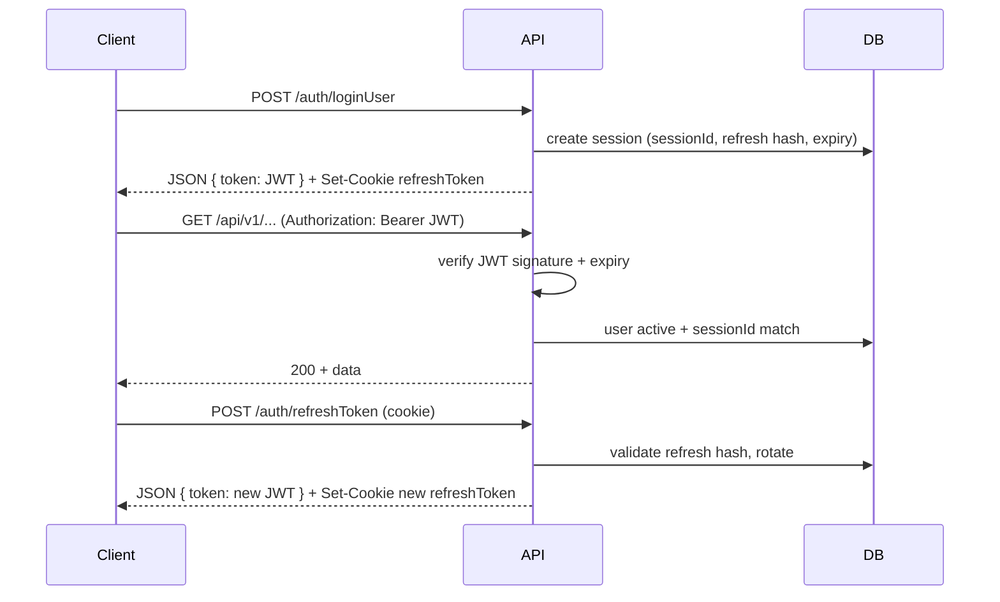

# JWT Access Token & Refresh Token Guide

This document describes how authentication works in the Rice-soft backend: short-lived **JWT access tokens** for API calls and **opaque rotating refresh tokens** stored in an **httpOnly cookie**.

---

## Overview

| Token | Type | Where it lives | Default lifetime | Purpose |
|-------|------|----------------|------------------|---------|
| **Access token** | Signed JWT | Client memory / localStorage (frontend choice) | `30m` (`JWT_EXPIRES_IN`) | Sent on every API request: `Authorization: Bearer <token>` |
| **Refresh token** | Opaque string | **httpOnly cookie** (`refreshToken` by default) | `1d` in DB (`JWT_REFRESH_EXPIRES_IN`); cookie may be session-only | Used only to obtain a new access token via `POST /auth/refreshToken` |

The access token is **stateless** (verified with `JWT_SECRET`). The refresh token is **stateful** (only a SHA-256 hash is stored in PostgreSQL).

---

## Architecture



---

## Access token (JWT)

### Generation

Created in `authSessionService.createSession()` and on every refresh rotation via `JWTService.generateToken()`.

**Payload** (`TokenPayload`):

```json
{
  "userId": "uuid",
  "username": "john",
  "sessionId": "uuid"
}
```

**Signing:** HS256 with `JWT_SECRET` (`app.config.ts` → `jwt.secret`).

**Expiry:** `JWT_EXPIRES_IN` (default `30m`). Formats like `30m`, `1h`, `7d` are supported by `jsonwebtoken`.

### Validation (`authenticate` middleware)

On each protected route:

1. Read `Authorization: Bearer <token>`
2. Verify signature and expiry (`JWTService.verifyToken`)
3. Load user from DB — must exist and `is_active = true`
4. Compare JWT `sessionId` with `users.active_session_id`
   - **Mismatch → 401** `"Session expired. Please log in again."` (logged in elsewhere or logged out)

There is **no server-side JWT blocklist**. Invalidating a session is done by clearing/changing `active_session_id` and refresh hashes in the DB.

---

## Refresh token (opaque, rotating)

### Format

Generated in `utils/refresh-token.ts`:

```
{sessionId}.{64-char-hex-secret}
```

Example shape: `a1b2c3d4-....-uuid`.`<random 32 bytes as hex>`

- `sessionId` = same UUID stored in `users.active_session_id`
- Enables lookup via `findByActiveSessionId(sessionId)` without putting `userId` in the cookie

### Storage

| Location | What's stored |
|----------|----------------|
| **Browser cookie** | Full opaque refresh token (httpOnly) |
| **Database** | `SHA-256(refreshToken)` hex in `users.refresh_token_hash` |

The raw refresh token is **never** stored in the database.

### Cookie settings

Configured in `app.config.ts` → `auth`:

| Env var | Default | Meaning |
|---------|---------|---------|
| `REFRESH_COOKIE_NAME` | `refreshToken` | Cookie name |
| `REFRESH_COOKIE_PATH` | `/` | Cookie path |
| `REFRESH_COOKIE_SAME_SITE` | `lax` | `strict` \| `lax` \| `none` |
| `REFRESH_COOKIE_SESSION` | `true` (when env unset) | If `true`, cookie has **no `maxAge`** (cleared when browser closes). Set to `false` for persistent cookie aligned with `JWT_REFRESH_EXPIRES_IN`. |

Cookie flags:

- `httpOnly: true` — not readable from JavaScript
- `secure: true` in production (`NODE_ENV=production`)

**CORS:** `credentials: true` is enabled in `app.ts`. Frontend must use `withCredentials: true` / `credentials: 'include'` and an allowed `CORS_ORIGIN`.

---

## Session lifecycle

### 1. Login (`POST /api/v1/auth/loginUser`)

Also applies to **OTP login** (`POST /api/v1/auth/verifyOtp`) — both call `completeLogin()`.

Steps:

1. Validate credentials (or OTP)
2. `authSessionService.createSession(userId, username)`:
   - New `sessionId` (UUID)
   - New opaque refresh token
   - Store `refresh_token_hash`, `refresh_token_expires_at` (now + `JWT_REFRESH_EXPIRES_IN`)
   - Clear `previous_refresh_token_*` grace fields
   - Issue new JWT with same `sessionId`
3. Set httpOnly refresh cookie
4. Return JSON:

```json
{
  "success": true,
  "data": {
    "user": { ... },
    "token": "<JWT access token>",
    "expires_in": "30m",
    "refresh_expires_in": "1d",
    "permissions": { ... }
  }
}
```

**Single active session:** Creating a session **replaces** the previous `active_session_id` and refresh hash. Any older JWT or refresh token for that user stops working (except grace window below).

### 2. Authenticated API calls

```
Authorization: Bearer <access token>
```

Use the JWT until it expires (~30 minutes) or until session is revoked.

### 3. Refresh (`POST /api/v1/auth/refreshToken`)

**No body required.** The refresh token must be sent automatically via cookie.

Steps (`authSessionService.rotateRefreshToken`):

1. Parse `sessionId` from cookie value
2. Find user where `active_session_id = sessionId`
3. Reject if inactive, missing hash, or past `refresh_token_expires_at` (session cleared on expiry)
4. Hash incoming token and compare:
   - **Matches current hash** → rotate (issue new access + refresh)
   - **Matches previous hash within grace period** → rotate (handles concurrent refresh / double tab)
   - **Matches previous hash after grace** → **reuse detected** → session revoked, cookie cleared, 401
   - **Unknown hash** → 401 (session **not** revoked — avoids logging out on bad cookie)

**Rotation** (`issueRotatedTokens`):

- New opaque refresh token + new hash
- Old current hash moved to `previous_refresh_token_hash` with `previous_refresh_token_valid_until` = now + `REFRESH_GRACE_PERIOD_SEC` (default **30 seconds**)
- New JWT with **same** `sessionId` (session id does not change on refresh)

Response:

```json
{
  "success": true,
  "data": {
    "token": "<new JWT>",
    "expires_in": "30m",
    "refresh_expires_in": "1d"
  }
}
```

Plus `Set-Cookie` with the new refresh token.

Rate limit: **30 requests / 15 minutes** per IP (`refreshTokenLimiter`).

### 4. Logout (`POST /api/v1/auth/logoutUser`)

Requires valid access JWT.

1. `authSessionService.revokeSession(userId)` — clears session + refresh fields in DB
2. Clears refresh cookie
3. Existing JWT may still decode until expiry, but **`authenticate` rejects** it because `active_session_id` no longer matches

### 5. Password change (`POST /api/v1/auth/changeUserPassword`)

Same as logout for sessions: revokes session and clears refresh cookie. User must log in again.

---

## Database columns (`users`)

| Column | Purpose |
|--------|---------|
| `active_session_id` | Current session UUID; embedded in JWT |
| `refresh_token_hash` | SHA-256 of current refresh token |
| `refresh_token_expires_at` | When refresh token expires |
| `previous_refresh_token_hash` | Prior hash accepted briefly during rotation |
| `previous_refresh_token_valid_until` | End of grace window for previous hash |

Migrations: `145_add_refresh_token_fields.sql`, `146_refresh_token_grace_period.sql`.

---

## Environment variables

```env
JWT_SECRET=...                    # Required in production
JWT_EXPIRES_IN=30m                # Access token TTL
JWT_REFRESH_EXPIRES_IN=1d         # Refresh token TTL (DB)

REFRESH_COOKIE_NAME=refreshToken
REFRESH_COOKIE_PATH=/
REFRESH_COOKIE_SAME_SITE=lax
REFRESH_COOKIE_SESSION=true         # false = persistent cookie with maxAge
REFRESH_GRACE_PERIOD_SEC=30

CORS_ORIGIN=http://localhost:3001   # Must match frontend origin for cookies
```

---

## API endpoints

| Method | Path | Auth | Description |
|--------|------|------|-------------|
| POST | `/api/v1/auth/loginUser` | Public | Password login → JWT + refresh cookie |
| POST | `/api/v1/auth/verifyOtp` | Public | OTP login → JWT + refresh cookie |
| POST | `/api/v1/auth/refreshToken` | Cookie only | Rotate refresh token, new JWT |
| POST | `/api/v1/auth/logoutUser` | Bearer JWT | Revoke session + clear cookie |
| POST | `/api/v1/auth/changeUserPassword` | Bearer JWT | Change password + revoke all sessions |

---

## Frontend integration

### Login

```typescript
await fetch(`${API}/auth/loginUser`, {
  method: 'POST',
  credentials: 'include', // required for refresh cookie
  headers: { 'Content-Type': 'application/json' },
  body: JSON.stringify({ username, password }),
});

// Store data.token (JWT) in memory or secure storage — NOT the refresh token (it's httpOnly)
```

### API calls

```typescript
fetch(`${API}/saudas`, {
  credentials: 'include',
  headers: { Authorization: `Bearer ${accessToken}` },
});
```

### Refresh when access token expires (401)

```typescript
const refresh = await fetch(`${API}/auth/refreshToken`, {
  method: 'POST',
  credentials: 'include',
});
const { data } = await refresh.json();
accessToken = data.token;
// Retry original request with new accessToken
```

Recommended pattern: axios/fetch interceptor that on **401** (except login/refresh) calls refresh once, updates token, retries.

### Logout

```typescript
await fetch(`${API}/auth/logoutUser`, {
  method: 'POST',
  credentials: 'include',
  headers: { Authorization: `Bearer ${accessToken}` },
});
// Clear local access token
```

### Do not

- Store refresh token in localStorage (it is httpOnly by design)
- Send refresh token in JSON body or Authorization header (backend reads **cookie only**)
- Omit `credentials: 'include'` on refresh/login/logout

---

## Security properties

| Feature | Behavior |
|---------|----------|
| **Short-lived JWT** | Limits exposure if access token leaks |
| **httpOnly refresh cookie** | Mitigates XSS stealing long-lived refresh |
| **Rotating refresh tokens** | Each refresh invalidates the previous token (with grace) |
| **Reuse detection** | Presenting an old refresh after grace **revokes the whole session** |
| **Single session** | New login replaces `active_session_id` — other devices logged out |
| **Hashed refresh in DB** | DB leak does not expose usable refresh tokens |

---

## Key source files

| File | Role |
|------|------|
| `src/utils/jwt.ts` | JWT sign/verify |
| `src/utils/refresh-token.ts` | Opaque token format, hashing, TTL helpers |
| `src/utils/auth-cookies.ts` | Set/clear refresh cookie |
| `src/services/auth-session.service.ts` | Create session, rotate refresh, revoke |
| `src/controllers/auth.controller.ts` | Login, refresh, logout HTTP handlers |
| `src/middleware/auth.middleware.ts` | Bearer JWT + session id validation |
| `src/dao/user.dao.ts` | `updateSession`, `clearSession`, `findByActiveSessionId` |
| `src/config/app.config.ts` | JWT and cookie configuration |

---

## Related docs

- `SINGLE_DEVICE_SESSION_GUIDE.md` — older guide focused on `active_session_id` and `isSessionValid`. **Current behavior:** session mismatch on protected routes returns **401** from `authenticate` middleware directly; `isSessionValid` on responses is set to `true` when `authenticate` succeeds.

---

## Quick mental model

1. **Login** → get JWT (short) + cookie (long, opaque)
2. **API** → send JWT in header until it expires
3. **Refresh** → POST with cookie only → new JWT + new cookie (old refresh invalidated after grace)
4. **Logout / new login / reuse attack** → session cleared in DB → JWT and refresh both useless
