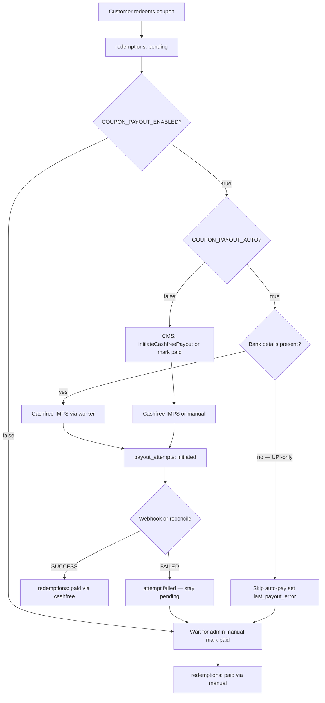

# Coupon Redemption & Payout Flow

End-to-end guide for how money moves after a coupon is redeemed: **pending → paid** via **manual mark-paid** or **Cashfree IMPS** auto-payout.

**Related docs**
- Module overview / APIs: [COUPON_MODULE.md](./COUPON_MODULE.md)
- Admin UI: [COUPON_ADMIN_UI_INTEGRATION.md](./COUPON_ADMIN_UI_INTEGRATION.md)
- Public redeem UI: [COUPON_PUBLIC_UI_INTEGRATION.md](./COUPON_PUBLIC_UI_INTEGRATION.md)
- Production env: [PRODUCTION_ENV.md](./PRODUCTION_ENV.md)

**Base path:** `/api/v1/coupons/`

---

## Big picture

Redeem always creates a `redemptions` row with `payout_status = pending`. Paying that redemption is a **separate** step.

| Path | When | Writes |
|---|---|---|
| **Manual mark paid** | Failed, skipped, or ops paid outside | Updates `redemptions` only (`paid_via = manual`) |
| **Cashfree CMS initiate** | `COUPON_PAYOUT_ENABLED=true` + `COUPON_PAYOUT_AUTO=false` (default) | Same as auto, started via admin API |
| **Cashfree auto-payout** | `ENABLED` + `AUTO=true` + bank + Cashfree configured | `payout_attempts` + webhooks + `paid_via = cashfree` |



**Important:** Coupon status (`allotted` → `redeemed`) is independent of payout. Redeem = “code used.” Payout = “money sent.”

---

## Tables

| Table | Role |
|---|---|
| `coupon_batches` | Print run, face value, expiry |
| `coupons` | One code; inventory lifecycle |
| `coupon_status_history` | Audit of coupon status changes |
| `redeemers` | Customer identity + saved payout/KYC details |
| `redemptions` | **Source of truth for amount owed / paid** |
| `rule_applications` | Which promotion bonuses applied on that redeem |
| `redemption_attempts` | Failed verify/redeem tries (fraud / debug) |
| `payout_attempts` | **Cashfree tries only** (never created for pure manual pay) |
| `cashfree_webhook_events` | Webhook audit + idempotency |

### Key `redemptions` columns

| Column | Meaning |
|---|---|
| `base_amount_paise` / `bonus_amount_paise` / `total_amount_paise` | Amount owed (paise) |
| `payout_upi_vpa` | UPI snapshot (optional; not used for auto-payout) |
| `payout_account_holder_name` / `payout_account_number` / `payout_ifsc` / `payout_bank_name` | Bank snapshot used for Cashfree IMPS |
| `payout_status` | `pending` \| `paid` |
| `paid_via` | `manual` \| `cashfree` (legacy enum also has `razorpay`) |
| `payment_reference` | Admin note / UTR / Cashfree UTR or `cf_transfer_id` |
| `last_payout_error` | Last auto-payout failure or skip reason |
| `paid_by` | Admin user id (manual path) |
| `idempotency_key` | Client key to prevent double redeem on retries |
| `public_ref` | Public reference for status polling |

### Key `payout_attempts` columns

| Column | Meaning |
|---|---|
| `transfer_id` | Merchant-generated Cashfree `transfer_id` (≤40 chars, unique, stable for the attempt) |
| `provider_transfer_id` | Cashfree `cf_transfer_id` |
| `amount_paise` | Amount attempted |
| `status` | `initiated` \| `success` \| `failed` |
| `failure_reason` | Provider / validation error text |
| `completed_at` | Set when status becomes `success` or `failed` |

Concurrency: at most **one** `initiated` attempt per redemption (partial unique index).

---

## Phase A — Inventory setup (admin)

1. Create batch → `coupon_batches`
2. Generate codes → `coupons` (`created` → `printed` → `allotted`)
3. Only `allotted` codes are redeemable

---

## Phase B — Customer redeem

### Public steps

1. OTP login → public JWT  
2. Optional: `GET /coupons/public/verifyBankAccount` (Surepass) when paying to bank  
3. `POST /coupons/public/verifyCoupon`  
4. `POST /coupons/public/redeemCoupon`

Redeem accepts **either** UPI **or** bank (or both). Auto-payout only runs when bank fields are present.

### What redeem does (one DB transaction)

1. Lock coupon (`FOR UPDATE`)
2. Validate: exists, not already redeemed, status `allotted`, not expired
3. Upsert `redeemers` by phone (name, UPI and/or bank)
4. If bank path: require Surepass KYC snapshot; mark bank verified on redeemer
5. Evaluate promotion rules → bonus paise
6. Insert `redemptions` with `payout_status = pending` and payout destination snapshot
7. Insert `rule_applications` (if bonuses)
8. Transition coupon → `redeemed` (+ `coupon_status_history`)
9. Increment redeemer stats

After commit:

```ts
if (COUPON_PAYOUT_ENABLED && COUPON_PAYOUT_AUTO) {
  couponPayoutWorker.enqueue(redemptionId);
}
```

If payout is off, or AUTO is off, flow stops at `pending` until admin initiates Cashfree or marks paid.

### Example rows after redeem

Assume ₹100 face value + ₹20 first-time bonus, bank redeem.

**`redeemers`**
```text
redeemer_id=R1
phone=98XXXXXXXX
name=Ram
account_number / ifsc / holder name stored
bank KYC verified via Surepass
```

**`redemptions`**
```text
redemption_id=X
public_ref=CR-XXXX
base_amount_paise=10000
bonus_amount_paise=2000
total_amount_paise=12000
payout_account_holder_name=Ram Kumar
payout_account_number=1234567890
payout_ifsc=SBIN0001234
payout_upi_vpa=null          -- or set if client also sent UPI
payout_status=pending
paid_via=null
payment_reference=null
last_payout_error=null
idempotency_key=<client uuid>
```

**`coupons`**
```text
status=redeemed
redeemed_at=<now>
```

**`payout_attempts`** — empty until Cashfree acquire runs.

---

## Phase C — Manual mark paid

Use when auto-payout is off, skipped, failed, or ops paid outside Cashfree.

### APIs

| Method | Path | Notes |
|---|---|---|
| `POST` | `/coupons/admin/markRedemptionPaid/:id` | Body: `{ payment_reference }` |
| `POST` | `/coupons/admin/bulkMarkRedemptionsPaid` | Batch of id + reference |
| `POST` | `/coupons/admin/unmarkRedemptionPaid/:id` | Correction → back to `pending` |

### Behaviour

`CouponPayoutService.markPaid`:

1. Require redemption exists and `payout_status === pending`
2. Update **only** `redemptions`:

```text
payout_status = paid
paid_via = manual
payment_reference = <admin string>
paid_by = <admin user id>
paid_at = now
last_payout_error = null
```

No `payout_attempts` row is created.

If a prior Cashfree attempt **failed**, that failed row remains for history; manual pay does not delete it.

Unmark paid clears paid fields and sets `payout_status` back to `pending` (does not reverse a Cashfree bank transfer).

---

## Phase D — Cashfree auto-payout

### Prerequisites

```env
COUPON_PAYOUT_ENABLED=true
COUPON_PAYOUT_AUTO=false                 # CMS initiate; set true for redeem enqueue + worker
CASHFREE_CLIENT_ID=...
CASHFREE_CLIENT_SECRET=...
CASHFREE_ENV=sandbox          # or production
# CASHFREE_API_VERSION=2024-01-01
# CASHFREE_FUNDSOURCE_ID=...  # optional
COUPON_PAYOUT_WORKER_INTERVAL_MS=300000   # default 5 minutes (AUTO mode only)
```

| Env | Base URL |
|---|---|
| sandbox | `https://sandbox.cashfree.com/payout` |
| production | `https://api.cashfree.com/payout` |

Cashfree dashboard: enable Payouts, whitelist server IP (or 2FA signature), fund wallet/bank, enable **IMPS**, register webhook URL:

```text
POST {API_PREFIX}/coupons/admin/webhooks/cashfree
```

Migration: `187_cashfree_coupon_payouts.sql`

### D1. Worker triggers (only when `COUPON_PAYOUT_AUTO=true`)

| Trigger | When |
|---|---|
| Immediate enqueue | After redeem if ENABLED + AUTO |
| Interval poll | Every `COUPON_PAYOUT_WORKER_INTERVAL_MS` |
| Admin initiate / retry | `POST .../initiateCashfreePayout/:id` or `.../retryPayout/:id` (works with AUTO off) |

Poll does two things:

1. Pending redemptions **without** an `initiated` attempt → create transfer  
2. Pending redemptions **with** `initiated` + `transfer_id` → **reconcile only** (`GET` status)

### D2. Acquire attempt

In a DB transaction:

1. Lock redemption; must still be `pending`
2. Ensure no existing `initiated` attempt
3. Require bank: account number + IFSC + holder name  
   - Missing (UPI-only) → set `last_payout_error = 'Bank account required for auto payout'`, **no** attempt, return
4. Insert `payout_attempts`:

```text
status=initiated
amount_paise=12000
transfer_id=cp_<32 hex>     # stable for this attempt
provider_transfer_id=null
```

### D3. Create transfer

`POST /transfers` with headers `x-client-id`, `x-client-secret`, `x-api-version`.

```json
{
  "transfer_id": "cp_...",
  "transfer_amount": 120.00,
  "transfer_currency": "INR",
  "transfer_mode": "imps",
  "transfer_remarks": "Coupon Redemption",
  "beneficiary_details": {
    "beneficiary_name": "Ram Kumar",
    "beneficiary_instrument_details": {
      "bank_account_number": "1234567890",
      "bank_ifsc": "SBIN0001234"
    }
  }
}
```

Notes:

- Amount is **rupees** (`total_amount_paise / 100`), minimum `1.00`
- Mode is **IMPS only** (v1)
- Beneficiary name is sanitized to letters/spaces for Cashfree validation

| Create result | Action |
|---|---|
| 2xx pending / received | Store `provider_transfer_id = cf_transfer_id`; leave `initiated` |
| 2xx SUCCESS | Mark paid immediately |
| 2xx FAILED / REJECTED | Attempt → `failed`; redemption stays `pending`; set `last_payout_error` |
| 4xx | Attempt → `failed` (definitive for this attempt) |
| 5xx / network / empty body | **Do not** treat as definitive fail → reconcile with **same** `transfer_id` |

### D4. Reconcile (same `transfer_id`)

`GET /transfers?transfer_id=cp_...`

| Status API result | Action |
|---|---|
| SUCCESS | Mark paid (`paid_via = cashfree`) |
| FAILED / REJECTED / REVERSED | Attempt → `failed`; stay pending |
| PENDING / RECEIVED / QUEUED / … | Leave `initiated`; wait for webhook or next poll |
| 404 not found | Attempt → `failed` with “create ambiguous; transfer not found” (safe to retry later with a **new** attempt) |
| 5xx on GET | Leave `initiated`; try again next poll |

Never mint a new `transfer_id` for an attempt that is still `initiated`. A new `transfer_id` only appears on a **new** attempt after the previous one is terminal `failed`.

### D5. Webhook

`POST /coupons/admin/webhooks/cashfree` (no JWT)

1. Require Cashfree credentials configured  
2. Verify signature on **raw body**:

   ```text
   base64(HMAC_SHA256(clientSecret, x-webhook-timestamp + rawBody))
   == x-webhook-signature
   ```

3. Insert `cashfree_webhook_events` (`status = received`, unique `cashfree_event_id`)  
4. Resolve attempt by `transfer_id`, then `cf_transfer_id`  
5. Apply terminal outcome:

| Event / status | Result |
|---|---|
| `TRANSFER_SUCCESS` / `TRANSFER_ACKNOWLEDGED` | Attempt `success`; redemption `paid`, `paid_via = cashfree`, `payment_reference = UTR \|\| cf_transfer_id` |
| `TRANSFER_FAILED` / `TRANSFER_REJECTED` / `TRANSFER_REVERSED` | Attempt `failed`; redemption stays `pending`; `last_payout_error` set |
| Other (e.g. `LOW_BALANCE_ALERT`) | Webhook marked `ignored` (Cashfree uses this to validate the URL) |

Duplicate event ids already `processed` / `ignored` are no-ops.

### Example rows after Cashfree success

**`payout_attempts`**
```text
status=success
transfer_id=cp_abc...
provider_transfer_id=123456789
completed_at=<now>
```

**`redemptions`**
```text
payout_status=paid
paid_via=cashfree
payment_reference=<UTR or cf_transfer_id>
paid_at=<now>
last_payout_error=null
```

**`cashfree_webhook_events`**
```text
event_type=TRANSFER_SUCCESS
status=processed
transfer_id=cp_abc...
payload={...}
```

### Failure + retry

After a failed attempt:

```text
payout_attempts.status=failed
redemptions.payout_status=pending
redemptions.last_payout_error=<reason>
```

Options:

1. `POST /coupons/admin/initiateCashfreePayout/:redemptionId` (alias: `retryPayout`)  
   - If `initiated` exists → reconcile only  
   - Else → new attempt + new `transfer_id`  
   - Response includes `payout_status`, `attempt`, and `message` for CMS UI
2. Manual mark paid after paying outside
3. Wait for worker poll (only when `COUPON_PAYOUT_AUTO=true`)

---

## Status machine (money)

```text
pending ──Cashfree SUCCESS──► paid (cashfree)
pending ──admin markPaid────► paid (manual)
paid    ──unmarkPaid────────► pending
pending ──Cashfree FAIL─────► pending (+ failed attempt + last_payout_error)
pending ──UPI-only skip─────► pending (+ last_payout_error, no attempt)
```

---

## Path comparison

| | After redeem only | Manual paid | Cashfree paid |
|---|---|---|---|
| `redemptions.payout_status` | `pending` | `paid` | `paid` |
| `paid_via` | null | `manual` | `cashfree` |
| `payout_attempts` | none | none | 1+ rows |
| `cashfree_webhook_events` | none | none | yes (if webhook delivered) |
| Bank required on redeem | optional | optional | required for auto path |

---

## Typical timeline (bank + Cashfree on)

1. Customer OTP → verify bank (Surepass) → redeem  
2. TX writes redeemer + redemption(`pending`) + coupon(`redeemed`)  
3. Worker enqueues → insert attempt(`initiated`, `transfer_id`) → `POST /transfers` IMPS  
4. Cashfree accepts → store `cf_transfer_id`  
5. Webhook `TRANSFER_SUCCESS` → redemption `paid` / `cashfree`  
6. Customer `GET /coupons/public/payoutStatus/:publicRef` → paid  

If webhook is delayed: within one poll interval the worker reconciles via Get Transfer Status.

---

## Code map

| Piece | Path |
|---|---|
| Redeem | `src/services/coupon-redeem.service.ts` |
| Manual mark / unmark / bulk | `src/services/coupon-payout.service.ts` |
| Cashfree create / reconcile / webhook | `src/services/cashfree-payout.service.ts` |
| Worker | `src/workers/coupon-payout.worker.ts` |
| Webhook route | `POST .../coupons/admin/webhooks/cashfree` |
| Config | `appConfig.cashfree` + `COUPON_PAYOUT_*` |
| Migration | `src/database/migrations/187_cashfree_coupon_payouts.sql` |

---

## Out of scope for this flow

| Concern | Notes |
|---|---|
| Surepass bank KYC | Verifies account before redeem; does not move money |
| IFSC lookup | Uses public Razorpay IFSC API for bank metadata only — unrelated to payouts |
| Promotion rules | Affect amounts only at redeem time |
| NEFT / UPI auto-payout | Not implemented; auto path is IMPS bank only |
| Cashfree refunds / reverse | Not implemented; use unmark + ops process if needed |

---

## Ops checklist (go-live)

1. Run migration `187_cashfree_coupon_payouts.sql`  
2. Set Cashfree sandbox credentials; keep `COUPON_PAYOUT_ENABLED=false` until tested  
3. Whitelist server IP; register webhook URL; confirm `LOW_BALANCE_ALERT` test ping returns 200  
4. Fund sandbox; enable IMPS  
5. Redeem a bank-verified coupon with payout enabled → confirm attempt + webhook → `paid_via = cashfree`  
6. Test UPI-only redeem → stays pending with `last_payout_error`  
7. Test manual mark paid and unmark  
8. Switch `CASHFREE_ENV=production` and production keys when ready  
